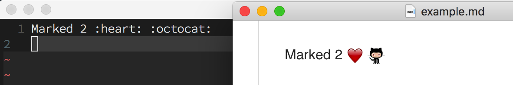

# GitHub emojis for Marked 2

[Marked 2](http://marked2app.com/) is a great markdown previewer and it works
really well with GitHub styles.  
It does not display GitHub emojis though.  
This repo contains a preprocessor to add support for emojis, so you can write
`:octocat:` in your code and see an emoji in previewer.

## Install

1. Download [zip file](https://github.com/tonyganch/marked-emojis/releases/download/v1.0/marked-emojis.zip). It contains emojis from GitHub and a preprocessor file.
1. In Marked 2 application open "Preferences" -> "Advanced" -> "Preprocessor".
1. Check "Enable Custom Preprocessor".
1. In "Path" field type in path to `preprocessor.sh` file inside downloaded
folder from step 1.
1. Done.

## Build

You can build and download all files yourself.

1. Clone the repo.
1. Run `build.sh` file. It will download emojis from GitHub and build
a preprocessor file. Please note that downloading may take some time.
1. In Marked 2 application open "Preferences" -> "Advanced" -> "Preprocessor".
1. Check "Enable Custom Preprocessor".
1. In "Path" field type in path to `preprocessor.sh` file inside the repo.
1. Done.

## Issues

1. Preprocessor is not smart enough so it will show emojis inside code blocks
too.
1. Preprocessor uses `sed` command for replacement so it must be present on your
computer.
